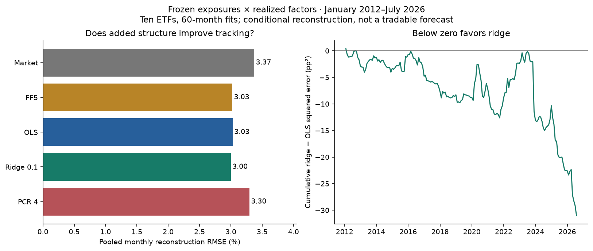
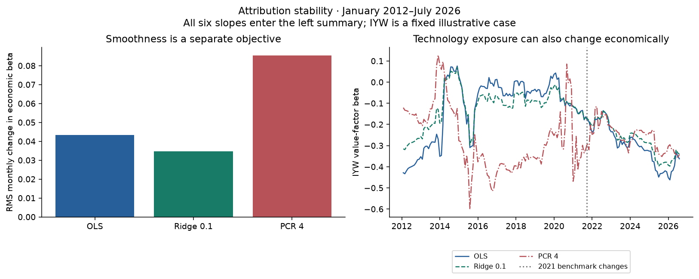

# What the evidence permits

The primary comparison **does not resolve a difference in conditional reconstruction error** for fixed ridge against OLS.
The paired mean difference is **-0.1772 squared percentage points**
(ridge minus OLS; 95% 12-month block interval **-0.3978 to 0.0282**).
The relative reduction in mean squared error is **1.93%**.
These are historical reconstruction errors, not strategy returns.

## Common experiment

Ten original broad iShares funds, 235 monthly returns from January 2007 to July 2026;
60-month rolling fits leave 175 evaluation months, January 2012–July 2026.
The revised factor files and adjusted prices are a single retrospective vintage.
Each target month's realized factors enter its reconstruction; no before-month factor
forecast or historical publication calendar is supplied.

<table class="dataframe">
  <thead>
    <tr style="text-align: right;">
      <th>model</th>
      <th>months</th>
      <th>etfs</th>
      <th>rmse_pct_monthly</th>
      <th>mse_pp2</th>
      <th>rms_beta_monthly_change</th>
      <th>mean_effective_df_including_intercept</th>
    </tr>
  </thead>
  <tbody>
    <tr>
      <td>Market</td>
      <td>175</td>
      <td>10</td>
      <td>3.3741</td>
      <td>11.3843</td>
      <td>0.0090</td>
      <td>2.0000</td>
    </tr>
    <tr>
      <td>FF5</td>
      <td>175</td>
      <td>10</td>
      <td>3.0256</td>
      <td>9.1540</td>
      <td>0.0407</td>
      <td>6.0000</td>
    </tr>
    <tr>
      <td>OLS</td>
      <td>175</td>
      <td>10</td>
      <td>3.0288</td>
      <td>9.1736</td>
      <td>0.0434</td>
      <td>7.0000</td>
    </tr>
    <tr>
      <td>Ridge 0.1</td>
      <td>175</td>
      <td>10</td>
      <td>2.9994</td>
      <td>8.9964</td>
      <td>0.0347</td>
      <td>6.1530</td>
    </tr>
    <tr>
      <td>PCR 4</td>
      <td>175</td>
      <td>10</td>
      <td>3.2979</td>
      <td>10.8761</td>
      <td>0.0854</td>
      <td>5.0000</td>
    </tr>
  </tbody>
</table>

## Conditioning and the bias–variance trade-off

The standardized six-factor design has median rolling condition number
**2.94**, range **2.42–3.74**.
This diagnoses observed factor geometry; it does not justify presuming catastrophic
multicollinearity. The constructed SVD chapter deliberately illustrates a much more
extreme case. Ridge shrinks all directions; PCR rank four throws two directions away
even when their factor variance is small but economically relevant.

Compare the [estimator sensitivities](../research/results/estimator_sensitivity.csv),
[window comparisons](../research/results/window_sensitivity.csv), and
[6/12-month block intervals](../research/results/paired_intervals.csv).
The window table includes both each available sample and **common dates beginning
2017-01**. No sensitivity replaces the fixed primary result. Bootstrap intervals
resample realized loss paths without refitting models and assume useful within-sample
dependence stability; they neither correct research selection nor establish performance
under a new structural break.

## Intercepts and economic interpretation

0 of ten full-sample OLS intercepts have Holm-adjusted
p-values below 0.05. The [complete table](../research/results/alpha.csv) includes annual
arithmetic intercepts, six-lag HAC standard errors, pointwise intervals and adjusted
p-values. Annualization here is 12 times a monthly coefficient, not a compounded return.
Ridge coefficients receive no reused OLS p-values. An intercept is conditional on this
factor model, constant-beta approximation, source vintage and selected ETF universe;
it does not establish manager skill, mispricing or implementable hedged profit.

## What would change the assessment?

An independent later period, point-in-time factor releases and independently reconciled
fund total returns would strengthen a portability claim. Holdings and dated benchmark
constituents would help distinguish estimation noise from genuine mandate changes.
Transaction-level hedge construction and costs would be necessary for a strategy claim.
See the [research agenda](../research/RESEARCH_AGENDA.md).
