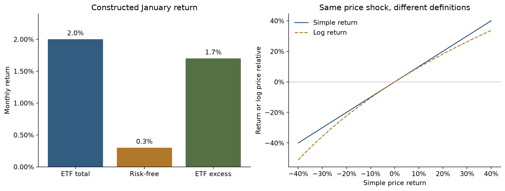

# Getting excess returns right

A factor regression starts with an economic measurement contract: complete months, simple ETF returns, consistent percentage units, and one subtraction of the risk-free rate. This constructed example makes the original unit and partial-month errors visible before any model is fitted.

[Open the executed notebook](study.ipynb) · [Research overview](../../README.md)

This note outlines the research argument. Worked calculations and tables referenced below are in the linked notebook; selected figures are reproduced at the end of this note.

## Goal

Follow a price move from 100 to 102 through month selection, return
calculation, percentage conversion, and excess-return construction.
Every price and factor value below is **constructed**, not market data.
The three declared month-end sessions are a small fixture; they do not
substitute for the production workflow's complete daily-session checks.

A date label is not evidence that a month is complete. Likewise,
an observation month does not establish when a factor was published.

### 1. Keep only completed months

December supplies January's starting price. The latest March quote
is dated March 14, before the declared March 31 session; it cannot be
treated as a full March observation. No absent price is forward filled.

### 2. Convert the supplied percentages once

For an ETF, $y_t=P_t/P_{t-1}-1-RF_t$. The French `Mkt-RF`
column is **already** an excess return; SMB, HML, RMW, CMA, and
momentum are long–short factor returns. Do not subtract RF again
from these regressors. The factor table here is an illustrative fixture.

### 3. Separate a unit error from a return-definition choice

The January excess return is 1.7%, obtained from 2.0% minus 0.3%.
Log returns are also legitimate quantities, but they do not equal
simple returns and cannot silently replace them in this model.
The second panel shows their difference for constructed price shocks.

### 4. Keep the economic checks beside the arithmetic

These two constructed months make the ETF excess return equal to the
market excess return. Subtracting RF a second time from `Mkt-RF`
breaks that identity. Missing a required month must fail a production
calculation; dropping a broken middle month and taking the next price
ratio would create a multi-month return with a misleading monthly label.

## Takeaway

A regression cannot repair incompatible units or a partial-month return.
The empirical study applies this contract to pinned data and validates
actual exchange-session coverage. Continue to the
[SVD geometry notebook](../02-svd-geometry/study.ipynb), or inspect the
[data sources](../../research/SOURCES.md) and [protocol](../../research/PROTOCOL.md).

## Evidence preview

## Further reading
[Data](../../docs/01-data.md) · [Methods](../../docs/02-methods.md) · [Source register](../../research/SOURCES.md)
