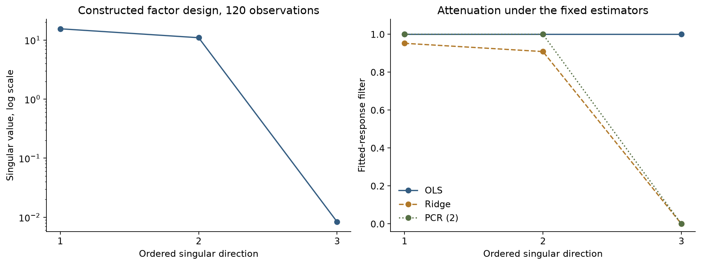
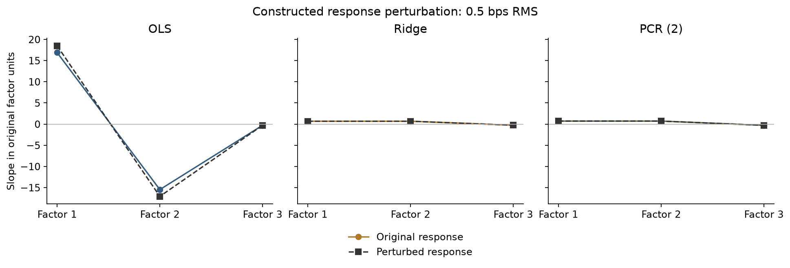

# Why unstable betas can still fit returns

SVD separates well-observed combinations of factors from weakly identified directions. A controlled three-factor example compares OLS, ridge, and two-component PCR after a small, deliberately aligned response perturbation. The example explains a mechanism; actual factor conditioning is measured separately.

[Open the executed notebook](study.ipynb) · [Research overview](../../README.md)

This note outlines the research argument. Worked calculations and tables referenced below are in the linked notebook; selected figures are reproduced at the end of this note.

## Goal

Two nearly identical regressors identify their **combined** exposure
much better than their separate coefficients. We construct that
geometry, add a small response perturbation along its weakest direction,
and compare coefficient changes with reconstruction changes.

All observations are constructed. The planted response has zero intercept
and slopes $(0.7,0.7,-0.3)$. Its noise and the later perturbation are
explicitly supplied; neither is estimated from market history.

### 1. Three ways to treat the same singular directions

OLS uses every numerically identified direction. Ridge solves
$\|y_c-Z\gamma\|^2/n+\lambda\|\gamma\|^2$, with
$\lambda=0.1$ and unpenalized intercept. Its fitted-response filter
is $s_j^2/(s_j^2+n\lambda)$. PCR keeps two directions and gives
the third a zero filter. Centering and scaling use only this fitting
sample; output slopes are returned to the original factor units.

### 2. Inspect the filters before interpreting the coefficients

The small singular value measures weak support for one combination of
named factors. Its squared value, not its value alone, determines its
share of design variance. Dropping a low-variance direction may remove
useful response information; explained variance is not predictive merit.

### 3. Add a known perturbation and keep the comparison paired

The response perturbation has RMS **0.5 basis points** and is
deliberately aligned with the smallest left singular vector. This is
a sensitivity construction, not a typical-noise claim. Independently
generated probe factors either preserve the original near-collinearity
or increase the difference between factors 1 and 2. Probe results measure
changes caused by the perturbation, not total forecast error.

### 4. Verify the algebra along an independent path

A direct least-squares solve supplies an OLS check. A direct penalized
normal-equation solve checks ridge on this controlled design. The latter
is a validation identity, not a recommendation to form normal equations
for ill-conditioned unregularized production regressions.

## Takeaway

SVD explains where the sensitivity comes from. Ridge and PCR trade that
sensitivity for bias; neither creates additional economic information.
Using SVD to solve ordinary least squares does not itself regularize the
model. The empirical study must measure actual conditioning and compare
reconstruction losses before drawing a conclusion about sector ETFs.

Continue to [alpha and uncertainty](../03-alpha-uncertainty/study.ipynb),
or read the [empirical protocol](../../research/PROTOCOL.md).

## Evidence preview

## Further reading
[Data](../../docs/01-data.md) · [Methods](../../docs/02-methods.md) · [Source register](../../research/SOURCES.md)
