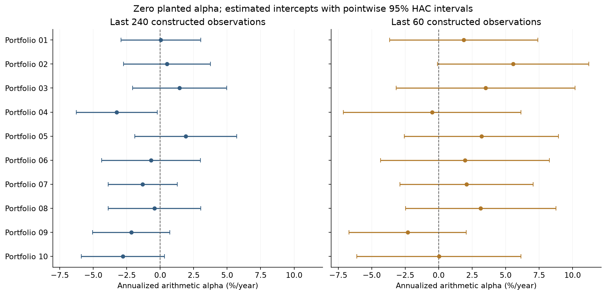

# An intercept is an estimate, not evidence of skill

Ten constructed portfolios share factor and residual shocks but have no planted alpha. Estimate intercepts with serial-dependence-aware uncertainty, compare 60 versus 240 observations, and account for the declared family of ten tests. One realization illustrates interpretation; it does not validate test coverage.

[Open the executed notebook](study.ipynb) · [Research overview](../../README.md)

This note outlines the research argument. Worked calculations and tables referenced below are in the linked notebook; selected figures are reproduced at the end of this note.

## Goal

A fitted intercept can be nonzero even when the data-generating model's
intercept is zero. This constructed ten-portfolio panel has six factor
exposures, correlated residual shocks, and AR(1) residual persistence.
Its population intercepts are all zero by construction; sample residual
means are not forced to zero before fitting.

We report six-lag Newey–West intervals with the study's finite-sample
correction and normal approximation. Multiplying intercepts and standard
errors by 12 expresses **annualized arithmetic alpha**, not compounded
returns. These are approximate intervals, especially in the short sample.

### 1. Estimate a declared family of ten intercepts

Fit all six regressors with an intercept. Serial correlation motivates
HAC rather than an independent-observation standard error. The ten
full-sample intercepts form one testing family; the short-sample
diagnostic forms a separate, explicitly labeled family. Selecting
whichever sample appears most significant would require a wider family.

### 2. Keep the interval with the estimate

Each point is an estimated intercept; each line is its **pointwise**
95% normal-approximation HAC interval. They are not simultaneous
confidence intervals. Both panels use the same units, portfolio order,
and horizontal scale. Shorter histories can change estimates as well
as precision; the effect is measured here rather than guaranteed.

### 3. Do not search ten intercepts and report one as a single test

Holm's adjustment is a step-down familywise procedure and does not
require independent tests when the underlying p-values are valid.
Here the raw HAC p-values themselves rely on an asymptotic approximation;
the adjustment does not repair poor small-sample inference. The counts
below describe this one fixed realization, not a simulated rejection rate.

### 4. Reconcile the intercept and the adjustment

A separate least-squares call checks the point estimates. Sorting and
cumulatively maximizing the scaled p-values independently reconstructs
the Holm step-down adjustment. These are numerical identities, not
validation of nominal confidence-interval coverage under every process.

## Takeaway

Interpret an ETF intercept together with its benchmark model, time
sample, uncertainty, and the family of questions examined. An omitted
exposure, changing mandate, or estimation error can all affect a fitted
intercept. A model-relative unexplained mean is not demonstrated skill
or an executable hedged return.

Read the [empirical protocol](../../research/PROTOCOL.md) and
[method references](../../research/SOURCES.md), then return to the
[combined study](../../study.ipynb).

## Evidence preview

## Further reading
[Data](../../docs/01-data.md) · [Methods](../../docs/02-methods.md) · [Source register](../../research/SOURCES.md)
